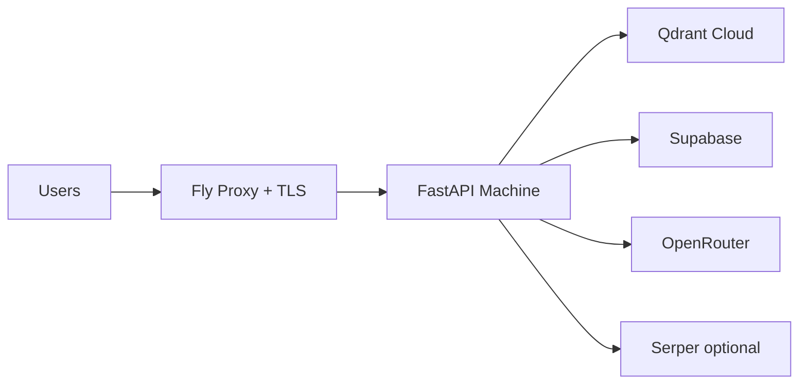

# Deployment Appendix (Fly.io)

This appendix documents the production deployment baseline for ArtMentorAI: FastAPI on Fly.io, vectors on Qdrant Cloud, and third-party integrations configured via environment variables/secrets.

## Architecture

## Secrets Policy

- Do not commit real credentials to git. Keep `.env` local only; use `.env.example` as the template.
- Store production secrets with `fly secrets set` (for example: `OPENROUTER__API_KEY`, `SUPABASE__SERVICE_ROLE_KEY`, `QDRANT_API_KEY`, `WEB_SEARCH_API_KEY`).
- Keep non-secret runtime settings in `fly.toml` `[env]` when appropriate (for example: `ENVIRONMENT=production`, `SERVER__HOST=0.0.0.0`, `SERVER__PORT=8000`, `DEBUG=false`).
- Restrict CORS in production to known frontend origins only; do not use wildcard origins with credentials.
- Rotate keys immediately if any secret is exposed in logs, screenshots, or commit history.

## Rollback Runbook (Fly Releases)

Use this checklist if a deploy regresses behavior:

1. Inspect health and logs:
   - `fly status`
   - `fly logs`
   - Confirm `/health` is failing or error rate has increased.
2. Identify the previous stable release:
   - `fly releases`
3. Roll back to that release:
   - `fly releases revert <VERSION>`
4. Verify recovery:
   - `fly status`
   - `curl https://<app>.fly.dev/health`
   - Smoke-test `/auth/me`, `/analysis/critique`, and `/analysis/vector-db-health`.
5. Record incident notes (release ID, symptom, root cause, corrective action) for the thesis appendix/change log.

## Monthly Cost Estimate (Student Scale)

These are rough planning numbers and depend on traffic, region, and provider pricing tiers.

- Fly.io API machine (1 always-on shared-cpu VM, ~1 GB RAM): low tens of USD per month.
- Qdrant Cloud (starter/free to small paid tier): free to low tens of USD per month.
- Supabase: free tier for demo workloads, paid tiers if auth/storage/query limits are exceeded.
- OpenRouter + Serper: usage-based; cost scales with request volume and prompt/token size.

**Typical demo budget range:** approximately 20-60 USD/month for a low-traffic deployment, excluding unusually heavy model usage.
